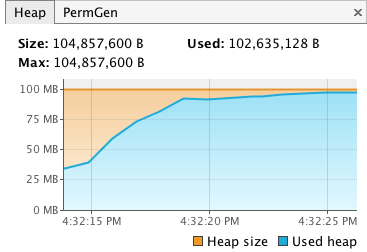
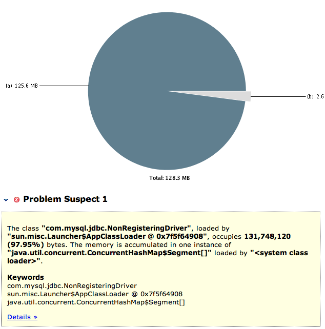
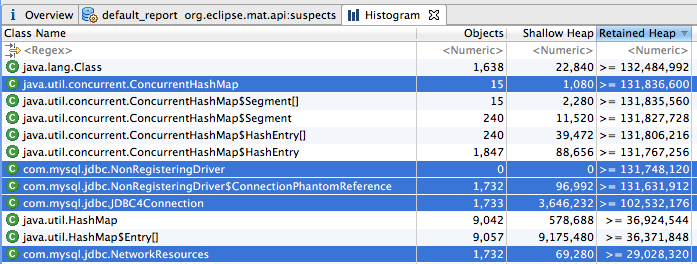
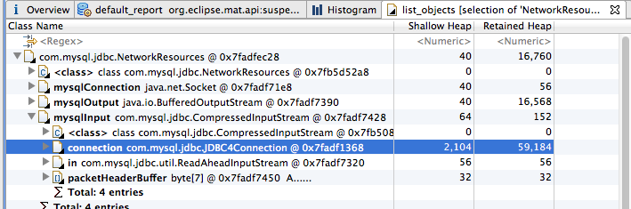

## Synopsis

Demonstration (org.greencheek.trackconnection.MainSimpleConnection), that simply
connects to a MySQL database and performs a select count(*) from items; on the database.

When a connection is created, the connection is registered with the NonRegisteringDriver
so that the connection can be tracked and monitoring, in case the Connection is abandoned
by the client application without it calling "close" on that Connection.

The NonRegisteringDriver uses PhantomReferences to track com.mysql.jdbc.Connection instances,
in kind of similar way to that described here: https://weblogs.java.net/blog/kcpeppe/archive/2011/09/29/mysterious-phantom-reference
The com.mysql.jdbc.ConnectionPhantomReference keeps hold of a com.mysql.jdbc.NetworkResources object
that is generated from the Connection instance.

When the last Strong reference to the Connection instance is nulled out, the jvm queue's the
Connection on the reference queue that is monitored by the NonRegisteringDriver.refQueue,
within the com.mysql.jdbc.AbandonedConnectionCleanupThread thread.

This cleanup Thread calls cleanup on the ConnectionPhantomReference, which in turn calls
forceClose on the com.mysql.jdbc.NetworkResources object to close the input and output streams
that are associated with the connection.

The whole point of the above process is to make sure if a client application abandons a
mysql connection without closing the resources (Input/Output streams) associated with that
connection, then the clean up thread will close those resources as a safety mechanism.

However, when 'useCompression=true' is enabled, the trackConnection that is part of the
com.mysql.jdbc.NonRegisteringDriver; causes a Memory Leak; as it causes the Connection objects
 JDBC4Connection (ConnectionImpl) to be held onto due to a strong reference within
 the  ConnectionPhantomReference.


What appears to be the issue is that the 'CompressionInputStream', has a reference to the
same ConnectionImpl, for which the ConnectionPhantomReference is waiting to be queue on
 the ReferenceQueue saying it is eligible for garbage collection.   The ConnectionPhantomReference
has a strong reference to the CompressionInputStream, via the com.mysql.jdbc.NetworkResources object
it references.  The ConnectionPhantomReference is strongly held by the static ConcurrentHashMap
in the NonRegisteringDriver.  The result is that ConnectionPhantomReference effectively
has a strong reference to the JDBC4Connection object it is meant to be waiting for being
GC'd; and is keeping the JDBC4Connection instance alive, and therefore not eligible
for garbage collection:


````

(waiting for GC eligibility)
 |-------------------------- ConnectionPhantomReference
 |                                       |
 |                                       |
 |                                       V
 |                                NetworkResources
 |                                       |
 |                                       |
 V                                       V
ConnectionImpl ------------------>  io (MysqlIO) -> inputStream (CompressedInputStream) -|
 ^                                                                                       |
 |_______________________________________________________________________________________|
````


----

#### Replication

There is the class: org.greencheek.trackconnection.MainSimpleConnection (running with the hotspot
options: -Xmx100m -Xms100m), that will simply connect to a database via the url: "jdbc:mysql://localhost:3306/testingconn?useCompression=true"
and perform a select count(*).

````
select /* a very large string so that we can see that compression is still enabled on the driver and that all things are equal with the WeakReference added to the CompressedInputStream */ count(*) from items"
````

It will execute the select count(*) several times, releasing the connection after each select.
After 100 selects, it does a simple allocation of some junk, to each up heap space, forcing GC to occur.
By forcing a gc this way Objects that are elligible for GC will be garbage, collected and PhantomReferences
will be enqueued on reference queue's for pre-cleanup operations.

At the end of the junk creation, it uses reflection to obtain the a reference to the
map "connectionPhantomRefs" in the com.mysql.jdbc.NonRegisteringDriver, and check the size of the map.

with "useCompression=true" the class will run out of memory, and the size of the map of
 ConnectionPhantomReference will grow.  With "useCompression=false", this will not occur


#### PreRequiste

To run org.greencheek.trackconnection.MainSimpleConnection, you need the following db

CREATE DATABASE `testingconn` CHARACTER SET utf8;
use testingconn;
CREATE TABLE `items` ( `item` varchar(128) DEFAULT NULL) ENGINE=InnoDB;
insert into items values ('blah');


#### Screenshots of the Problem


The Heap Growth as seen by VisualVM:




The class holding onto the ram, as shown by Eclipse MAT




The number of Connections, and the NetworkResources classes as shown by Eclipse MAT



Source of the Issue



#### The Apparent Source of the Problem


What appears to be the issue is that the 'CompressionInputStream', has a reference to the
same ConnectionImpl, for which the ConnectionPhantomReference is waiting to be queue on
 the ReferenceQueue saying it is eligible for garbage collection.   The ConnectionPhantomReference
has a strong reference to the CompressionInputStream, via the com.mysql.jdbc.NetworkResources object
it references.  The ConnectionPhantomReference is strongly held by the static ConcurrentHashMap
in the NonRegisteringDriver.  The result is that ConnectionPhantomReference effectively
has a strong reference to the JDBC4Connection object it is meant to be waiting for being
GC'd; and is keeping the JDBC4Connection instance alive, and therefore not eligible
for garbage collection.

In a rough pictorial form, this look something like the following


````
(waiting for GC eligibility)
 |-------------------------- ConnectionPhantomReference
 |                                       |
 |                                       |
 |                                       V
 |                                NetworkResources
 |                                       |
 |                                       |
 V                                       V
ConnectionImpl ------------------>  io (MysqlIO) -> inputStream (CompressedInputStream) -|
 ^                                                                                       |
 |_______________________________________________________________________________________|
````


With the normal com.mysql.jdbc.util.ReadAheadInputStream, you don't have the
back reference to the JDBC4Connection.  As a result the JDBC4Connection object
is eligible for GC when the client application releases it's strong reference to
the object:

````
(waiting for GC eligibility)
 |-------------------------- ConnectionPhantomReference
 |                                       |
 |                                       |
 |                                       V
 |                                NetworkResources
 |                                       |
 |                                       |
 V                                       V
ConnectionImpl ------------------>  io (MysqlIO) -> inputStream (ReadAheadInputStream)

````

#### Potential solution

The

